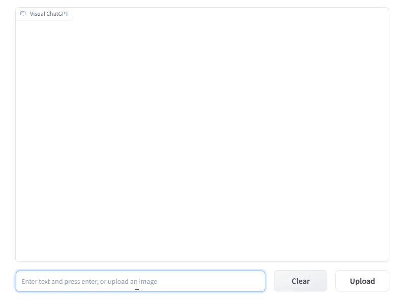
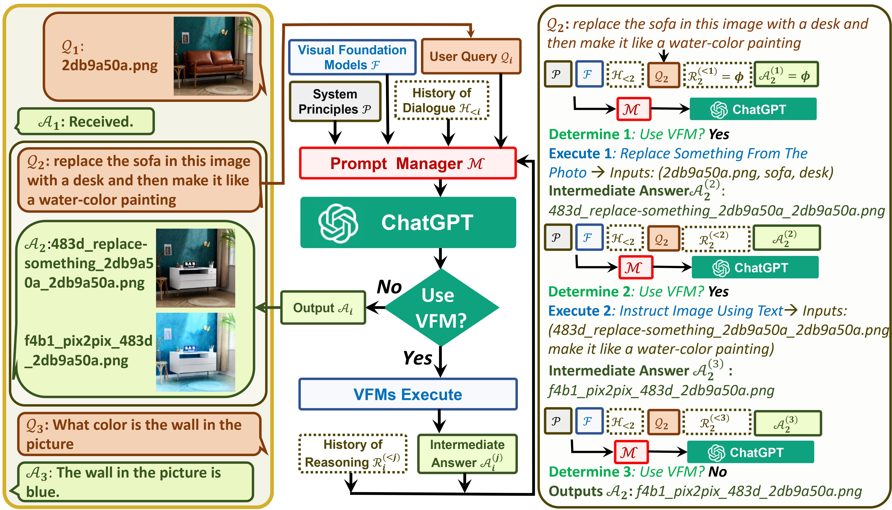

# Visual ChatGPT 

**Visual ChatGPT** connects ChatGPT and a series of Visual Foundation Models to enable **sending** and **receiving** images during chatting.

See our paper: [<font size=5>Visual ChatGPT: Talking, Drawing and Editing with Visual Foundation Models</font>](https://arxiv.org/abs/2303.04671)

<a src="https://img.shields.io/badge/%F0%9F%A4%97-Open%20in%20Spaces-blue" href="https://huggingface.co/spaces/microsoft/visual_chatgpt">
    
</a>

<a src="https://colab.research.google.com/assets/colab-badge.svg" href="https://colab.research.google.com/drive/11BtP3h-w0dZjA-X8JsS9_eo8OeGYvxXB">
    
</a>

## Updates:

- Add custom GPU/CPU assignment
- Add windows support
- Merge HuggingFace ControlNet, Remove download.sh
- Add Prompt Decorator
- Add HuggingFace and Colab Demo
- Clean Requirements


## Insight & Goal:
One the one hand, **ChatGPT (or LLMs)** serves as a **general interface** that provides a broad and diverse understanding of a
wide range of topics. On the other hand, **Foundation Models** serve as **domain experts** by providing deep knowledge in specific domains.
By leveraging **both general and deep knowledge**, we aim at building an AI that is capable of handling various tasks.


## Demo 


##  System Architecture 

 
<p align="center"></p>


## Quick Start

```
# clone the repo
git clone https://github.com/microsoft/visual-chatgpt.git

# Go to directory
cd visual-chatgpt

# create a new environment
conda create -n visgpt python=3.8

# activate the new environment
conda activate visgpt

#  prepare the basic environments
pip install -r requirements.txt

# prepare your private OpenAI key (for Linux)
export OPENAI_API_KEY={Your_Private_Openai_Key}

# prepare your private OpenAI key (for Windows)
set OPENAI_API_KEY={Your_Private_Openai_Key}

# Start Visual ChatGPT !
# You can specify the GPU/CPU assignment by "--load", the parameter indicates which 
# Visual Foundation Model to use and where it will be loaded to
# The model and device are separated by underline '_', the different models are separated by comma ','
# The available Visual Foundation Models can be found in the following table
# For example, if you want to load ImageCaptioning to cpu and Text2Image to cuda:0
# You can use: "ImageCaptioning_cpu,Text2Image_cuda:0"

# Advice for CPU Users
python visual_chatgpt.py --load ImageCaptioning_cpu,Text2Image_cpu

# Advice for 1 Tesla T4 15GB  (Google Colab)                       
python visual_chatgpt.py --load "ImageCaptioning_cuda:0,Text2Image_cuda:0"
                                
# Advice for 4 Tesla V100 32GB                            
python visual_chatgpt.py --load "ImageCaptioning_cuda:0,ImageEditing_cuda:0,
    Text2Image_cuda:1,Image2Canny_cpu,CannyText2Image_cuda:1,
    Image2Depth_cpu,DepthText2Image_cuda:1,VisualQuestionAnswering_cuda:2,
    InstructPix2Pix_cuda:2,Image2Scribble_cpu,ScribbleText2Image_cuda:2,
    Image2Seg_cpu,SegText2Image_cuda:2,Image2Pose_cpu,PoseText2Image_cuda:2,
    Image2Hed_cpu,HedText2Image_cuda:3,Image2Normal_cpu,
    NormalText2Image_cuda:3,Image2Line_cpu,LineText2Image_cuda:3"
                             
```

## GPU memory usage
Here we list the GPU memory usage of each visual foundation model, you can specify which one you like:

| Foundation Model        | GPU Memory (MB) |
|------------------------|-----------------|
| ImageEditing           | 3981            |
| InstructPix2Pix        | 2827            |
| Text2Image             | 3385            |
| ImageCaptioning        | 1209            |
| Image2Canny            | 0               |
| CannyText2Image        | 3531            |
| Image2Line             | 0               |
| LineText2Image         | 3529            |
| Image2Hed              | 0               |
| HedText2Image          | 3529            |
| Image2Scribble         | 0               |
| ScribbleText2Image     | 3531            |
| Image2Pose             | 0               |
| PoseText2Image         | 3529            |
| Image2Seg              | 919             |
| SegText2Image          | 3529            |
| Image2Depth            | 0               |
| DepthText2Image        | 3531            |
| Image2Normal           | 0               |
| NormalText2Image       | 3529            |
| VisualQuestionAnswering| 1495            |

## Acknowledgement
We appreciate the open source of the following projects:

[Hugging Face](https://github.com/huggingface) &#8194;
[LangChain](https://github.com/hwchase17/langchain) &#8194;
[Stable Diffusion](https://github.com/CompVis/stable-diffusion) &#8194; 
[ControlNet](https://github.com/lllyasviel/ControlNet) &#8194; 
[InstructPix2Pix](https://github.com/timothybrooks/instruct-pix2pix) &#8194; 
[CLIPSeg](https://github.com/timojl/clipseg) &#8194;
[BLIP](https://github.com/salesforce/BLIP) &#8194;

## Contact Information
For help or issues using the Visual ChatGPT, please submit a GitHub issue.

For other communications, please contact Chenfei WU (chewu@microsoft.com) or Nan DUAN (nanduan@microsoft.com).