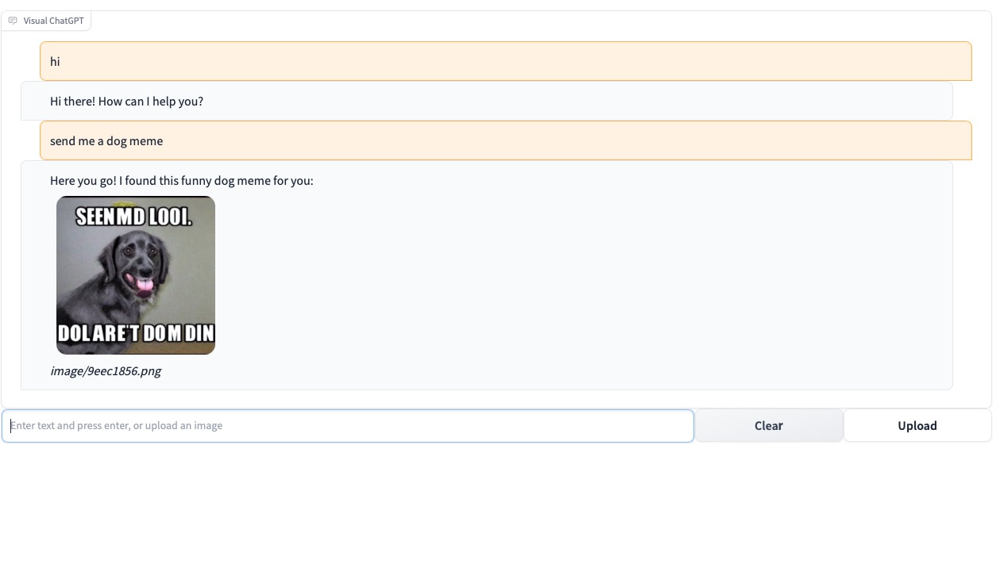
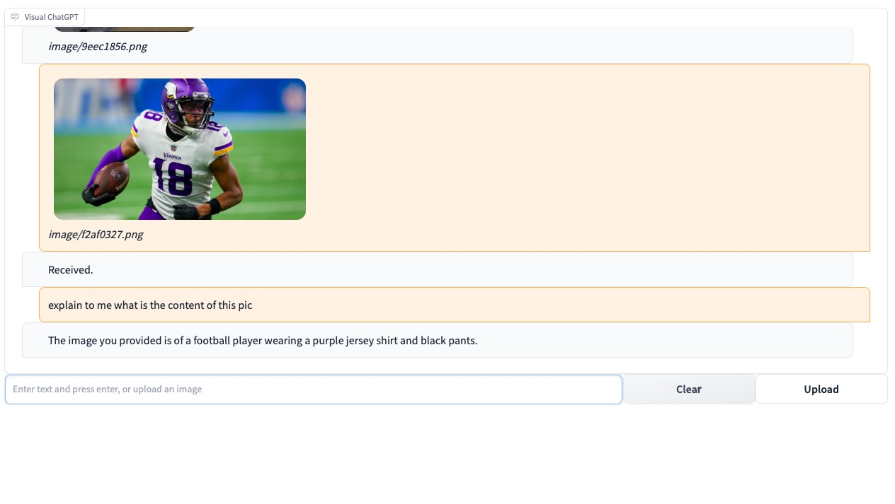

# Visual ChatGPT 

**Visual ChatGPT** connects ChatGPT and a series of Visual Foundation Models to enable **sending** and **receiving** images during chatting.

See our paper: [Visual ChatGPT: Talking, Drawing and Editing with Visual Foundation Models](https://arxiv.org/abs/2303.04671)

## Intro
I implement a google-colab version under standard GPU environment.
I just use two models `T2I` and `ImageCaption` to process images because of my insufficient GPU memory.
## Demo 
`T2I`

`ImageCaption`

## GPU memory usage
Here we list the GPU memory usage of each visual foundation model, one can modify ``self.tools`` with fewer visual foundation models to save your GPU memory:

| Foundation Model        | Memory Usage (MB) |
|------------------------|-------------------|
| ImageEditing           | 6667              |
| ImageCaption           | 1755              |
| T2I                    | 6677              |
| canny2image            | 5540              |
| line2image             | 6679              |
| hed2image              | 6679              |
| scribble2image         | 6679              |
| pose2image             | 6681              |
| BLIPVQA                | 2709              |
| seg2image              | 5540              |
| depth2image            | 6677              |
| normal2image           | 3974              |
| InstructPix2Pix        | 2795              |

## Acknowledgement
We appreciate the open source of the following projects:

[Hugging Face](https://github.com/huggingface) &#8194;
[LangChain](https://github.com/hwchase17/langchain) &#8194;
[Stable Diffusion](https://github.com/CompVis/stable-diffusion) &#8194; 
[ControlNet](https://github.com/lllyasviel/ControlNet) &#8194; 
[InstructPix2Pix](https://github.com/timothybrooks/instruct-pix2pix) &#8194; 
[CLIPSeg](https://github.com/timojl/clipseg) &#8194;
[BLIP](https://github.com/salesforce/BLIP) &#8194;

